class: inverse middle center

# Principles, Tips & Tricks For Maintainability

Road movie in developer's brain

.footnote[Marc DeXeT, SGS-FR, PAQA, Institut d'Astrophysique Spatiale (IAS)  
.small[marc.dexet@ias.u-psud.fr] ]

<!-- ......................................................................................... -->
---

# Itinerary 

* _What_ is _maintainability_,
* _Why_ is important,
* How to make code **_UN_**maintainable.
* How to make code maintainable.
 
.quote[.medium[We will focus on the code aspect mainly]]


<!-- ......................................................................................... -->
---

class: inverse middle center

# What's Maintainability ?

<!-- ......................................................................................... -->
---

# Maintainability Under Iso 25010 

* Characteristic of _Software Quality_ defined as 

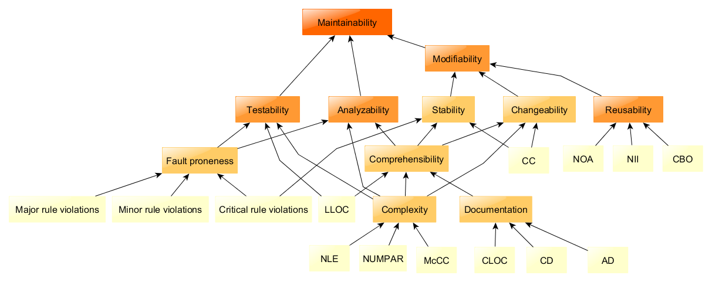

???
Maintainbility is a set of characteristics defined in ISO Twenty-five zero one zero
with a lot of words ending with "ility"


<!-- ......................................................................................... -->
---

# Maintainability Under Iso 25010 

* Characteristic of _Software Quality_ defined as 


???

like 

* Analysability
* Modifiability
* Testability
* Modularity
* Reusability

<!-- ......................................................................................... -->
---

# Maintainability Under Iso 25010 

* Characteristic of _Software Quality_ defined as 


???

* Analysability
* Modifiability
* Testability
* Modularity
* Reusability

-----

* Modularity. 
 * Degree to which a system or computer program is composed of discrete components such that a change to one component has minimal impact on other components.
* Reusability. 
 * Degree to which an asset can be used in more than one system, or in building other assets.
* Analysability. 
 * Degree of effectiveness and efficiency with which it is possible to assess the impact on a product or system of an intended change to one or more of its parts, or to diagnose a product for deficiencies or causes of failures, or to identify parts to be modified.
* Modifiability. 
 * Degree to which a product or system can be effectively and efficiently modified without introducing defects or degrading existing product quality.
* Testability. 
 * Degree of effectiveness and efficiency with which test criteria can be established for a system, product or component and tests can be performed to determine whether those criteria have been met.

<!-- ......................................................................................... -->
---

# Maintainability Under Iso 25010 

* Characteristic of _Software Quality_ defined as 


???

these concepts depend on other words en ility

* Stability
* Changeability
* Comprehensability
* Complexity
* Documentation
<!-- ......................................................................................... -->
---
class: splash middle center

.medium[ISO documents are expensive  
and no developer  
in this room  
will read them.
]

--

.medium[So...]

--

.big[Let's try to see this from the developer's point of view.]

<!-- ......................................................................................... -->
---
class: splash middle center


Just keep in mind

.center[ .huge[_Improving maintainability_  
is  
_**making code easy**_...]]

<!-- ......................................................................................... -->
---

.center[ .big[_Improving maintainability_]] 
.center[ .big[is]]
.center[ .big[ _**making code easy to**_...]]


## To understand 
* _**What**_ it does, 
* _**How**_ it does,

--

## To analyze 
* To _**locate**_ which part of code is responsible of _**what**_,
* To _**evaluate**_ impact of modification,
* To _**diagnose**_ failures on runtime.

--


## To modify
* To _**correct**_ bugs, to _**improve**_ and to _**evoluate**_.
--

* ..._without **exploding** at maintainer's face !_
<!-- ......................................................................................... -->
---

.center[ .big[_Improving maintainability_]] 
.center[ .big[is]]
.center[ .big[ _**making code easy to**_...]]


## To test

--

* to _think_ tests,
--

* to _write_ tests, 
--

* to _execute_ tests as frequently and quickly as possible

--

## To build as an assembly of _components_  
--

* such as that 
 * a change to **one** has _minimal impact_ on **others**.
--

 * they could be _reused_ in other parts of code 

<!-- ......................................................................................... -->
---

.center[ .big[_Improving maintainability_]] 
.center[ .big[is]]
.center[ .big[ _**making code easy to**_...]]


## To understand 
## To analyze
## To modify
## To test
## To build as an assembly of _components_  

<!-- ......................................................................................... -->
---

class: inverse middle center

# Why Maintainability is Important ?

<!-- ......................................................................................... -->
---

# Because Working is Not Enough

.big[.center[
Even if your car is **working** well,  
it's **dumb**  
if you **can not easily** change a light bulb  
when you need it.
]]

<center>

</center>

???

Even if your _code_ is working well, it's dumb  
if you can not easily _adapt_ a _functionnality_ when you need it.


<!-- ......................................................................................... -->

---

# Because Poor Maintainability is Costly


## Time is money
* Implement new ideas rather than fighting against a grumpy code !

???
Time is precious, use it to implement new ideas rather than fight against a angry code !

--


## An unpleasant code does not make you want to get involved
* Bad dispositions lower trust in code

???
As a **love story**, an unpleasant code does not make you want to get involved.
Bad disposition for evolution or ease of living lower trust you put in code.

--

## Sometimes it ends up in the trash 
 * And is recreated from scratch, one more time

???
When code is unpleasant and an alternative is possible, it ends in trash.


<!-- ......................................................................................... -->
---


# Because That's What We Spend Our Days


* As _**creator**_ of maintainability along code creation.
* As _**maintainer**_ suffering lack of this one.
--

* _Often the same person_. 

--

.center[
.huge[.quote[Yourself _as creator_,  
you should take care of  
yourself _as maintainer_   
... in a few month.]]
]


???
This not a kinf of after sales service, they continue your work.

<!-- ......................................................................................... -->
---
class: splash

# Because Fighting is Exhausting

--

.center[.big[Struggling _every day_ with code  
we _**are expected to**_ maintain  
but we _**don't succeed**_  
because someone _**didn't care**_  
_kills_ motivation.  ]]

--

<center>

</center>
 

--

.center[.big[Can we really afford to demotivate people in our labs ?]] 

???
.center[.small[Sometimes it leads to **depression** and to **impostor syndrome**.]]  


<!-- ......................................................................................... -->
---
class: center middle

# Creators And Maintainers Of The Code, UNITE !


<!-- ......................................................................................... -->

---
class: inverse middle center

# How To Make Code **Un**maintainable

And make maintainers cry ...

<!-- ......................................................................................... -->
---

# Act As Docteur Frankenstein

## Create a powerful patchwork of code tips

<center>
    
</center>


<!-- ......................................................................................... -->
---

# Act As Docteur Frankenstein

## And let it grow until no one can control it.

<center>
    
</center>


<!-- ......................................................................................... -->
---

# Build a House Of Cards 

## Make a code so delicate, fragile and insecure
* Impossible to modify anything without be afraid of breaking something.

<center>
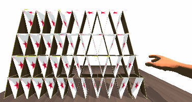
</center>


<!-- ......................................................................................... -->
---

# Create a Punishment 

<center>

</center>

---

# Create a Punishment 

.left-column[

## Let the code be

.medium[ 
* _disgusting_, 
* _neglected_, 
* and _unattractive_ .
]
]

--

.right-column[

.outline-code-medium[
```python
     # It's not OK !!
#def rnk_ob(arr,nb):
def rank_objects(a,n,nn):
    """
    Run proces to brk A
    - param arr : array to brek
    """
        # if len(a) < 0 :
    if a and n > 0 :
    # if arr and nb > minnb :
        #   fobje = [o for o in a if fn(o) in [1,3,9]]
        # fobje = [o for o in a if len(o) == n and fn(o)]
        fobje = [o for o in a if fn(o) not in v_arr]
        # TODO call SB to get response to last mail from Sam

    return fobje

#------------------------------
# def b(f) :
#   r = F.apply(z_fn) if z_fn else 0
# WTF ??? !!
```
]
]

<!-- ......................................................................................... -->

---


# Make An Elitist Code 

--

## Use ciphered expressions no one understand

```python

a,c,d = fn_rz220(v)
if a == alpha and c == beta[d] :
    z, zz, vzz, y = c_rt_rot(t)
c = cc_rt_rotZ(d) +zz if z < Z else None
if not c : 
    c = ccc_rt_rotZ2(d) + z

```

--

## Require a sharp expertise of your field to understand what's going on
* Your code must be earned.

--

## Don't question yourself when you answer the doubt with :

.center[.huge[`"Any fool can understand this if he's good enough !"`]]

--

.center[.huge[`"(as me)"`]]


???
How many times have we listened this phrase ?
<!-- ......................................................................................... -->
---

# Let Maintainance Be An Escape Game

<center>
    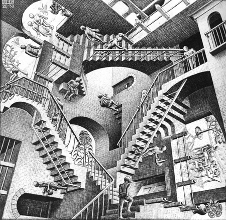
</center>

<!-- ......................................................................................... -->
---

# Let Maintainance Be An Escape Game

## Hide the context 
* _**Why**_ the code is needed, 
* _**What**_ the code is _exactly_ supposed to do, to answer to the _**Why**_
* _**How**_ the code is _exactly_ supposed to do the _**What**_

--

## Disorientate  
* Overwhelm with *wrong*, *scattered* or *outdated* informations.
* Mix up all abstraction levels.


<!-- ......................................................................................... -->
---

class: inverse middle center

# How To Make Code Maintainable

and make maintainers happy !


<!-- .......................................................................................... -->
---

class: splash center middle

# Principle #1

<!-- .......................................................................................... -->
---

class: splash center middle black_bkg


<!-- .......................................................................................... -->
---

class: splash center middle

Principle #1
# Code For Human

<!-- ......................................................................................... -->
---

class: splash center

Principle #1
# Code For Human

.quote[.center[.huge[_Any fool_ can write code  
that a _**computer**_ can understand.  
]]]
--

.quote[.center[.huge[_Good programmers_ write code  
that _**humans**_ can understand]]
]
.right[Martin Fowler]


<!-- ......................................................................................... -->
---

# First processor is human brain
--

## Good Points
* It detects _patterns_, _similarities_,
* It _learns_, _extrapolates_ and _generalizes_ quickly. 

--

## Not So Good Points
* Short-memory buffer limited to _**"The Magical Number Seven, Plus or Minus Two"**_.
* Cognitive and cultural _bias_.

???
* Short-memory buffer limited to _**"The Magical Number Seven, Plus or Minus Two"**_.
You can not keep more that seven items in memory at the same time.
* What's _obvious_ for one may not be for another...

<!-- ............................................................................................ -->
---
class: splash black_bkg

# Do Not Generate Dissonance

<center>
    
</center>

--


## In code 

```python
cake = Fruit()
fruit_list = "AIRBUS-A320"
```

--

## In comments

```python
# Use the Formula  H = Epsilon / 2.0 * Sigmaz() + Delta / 2.0 * Sigmax()
h = Epsilon / 2.0 * sigmaz()
```

.footnote[.small[https://imgur.com/gallery/5Fjnaid]]

<!-- ............................................................................................ -->
---
class: splash center

# Do Not Overload Mental Mapping


.center[
Brain is not good   
at following complex branching  
or keeping _arbitrary_ references.
]

<center>
    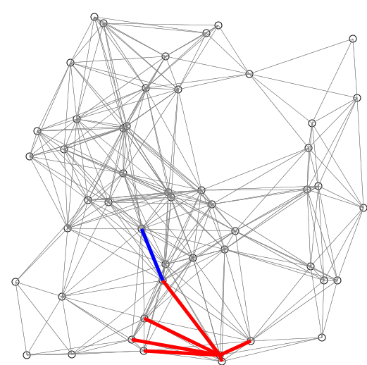
</center>


<!-- ............................................................................................ -->
---
class: splash center

# Give Regularity And Consistency

.center[Brain learns from _patterns_ if they're visible.] 

<center>
    
</center>


<!-- .......................................................................................... -->
---

class: splash center middle

# Principle #2

<!-- ......................................................................................... -->
---
class: splash middle center

Principle #2

.huge[_Make_]  
--

the  
--

.huge[_code_]  
--

.huge[**Readable**]    
--

!  
--

.footnote[please...]

<!-- ......................................................................................... -->
---

# Make Code Readable 

## As Any Writing, Code Tells Something. 
* It can tell **what** and **how** it does.

--

## Let The Code Tell The Story
* The more **self-explanatory**, the more **easy** to maintain. 

--

## You read 10 more than you write

You write once, but you read 
* to _check_, 
* to _understand_, 
* to _remember_, 
* to _copy_,
--

* and to _**rewrite**_.


<!-- ......................................................................................... -->
---

# Make Code Readable 


## Give good names to things 
* Things do not quite exist for brain until they have a good name.

--

## Divide code into small well-targeted paragraphs
* To keep brain focused and avoid to drown in details 


<!-- ......................................................................................... -->
---

class: splash center black_bkg

To illustrate the following examples, we are supposing you are ...  
--

A .quote[Starfleet (\*)] developer

.footnote[Star Trek]

--

# Maintaining the StarShip Class Euclid Procedures

--


<center>
    
</center>


<!-- ......................................................................................... -->

---
class: splash middle center

Make Code Readable
# 1 - Naming
to make things exist


<!-- ......................................................................................... -->

---
class: splash middle center

Naming
--

# Size Doesn't Matter

--

-----

.quote[.center[.huge[You're a **developer**,]]] 
--

.quote[.center[.huge[Not a **compressor**.]]]

<!-- ............................................................................................ -->
---
# Naming: Size Doesn't Matter 

## Shortness overloads mental mapping

.outline-code-big[
```python
if bh :
    gooh(bh)
```
]
--

## Example of an unhelpful dialogue

* **Brain**: Oh Damn it ! What is .medium[`BH`] again ?
--

* **Code**: .medium[`BH`] is the **B**lack **Hole** defined _50 lines above_ and _6 month ago_.
--

* **Brain**: Ah yes ! But what is .medium[`GOOH`] function again ?
--

* **Code**: (sigh) G-O-O-H as _**G**et_ _**O**ut_ _**O**f_ _**H**ere_... 


<!-- ............................................................................................ -->
---
# Naming: Comprehension Matters


.reset-column[]

.left-column[
.outline-code-big[
```python
if bh :
    gooh(bh)
```
]]

.right-column[
.outline-code-big[
```python
if black_hole :
    get_out_of_here(black_hole)
```
]]

.reset-column[]


<!-- ......................................................................................... -->
---
# Naming: Comprehension Matters 


## Avoid one or two letter names 
* Except for mathematical expressions and domain specific conventions.

--

## Avoid confusing abridged names  
* As .medium[`gaLocRfr`] for .medium[`GalaxyLocationReference`].

--

## Avoid unpronounceable names
* As .medium[`crhtw`] for _Critical Ratio Height To Weight_.

--

## Follow Scope Length Rule

* The name _**can**_ ( and not _should_ ) be as short as its scope

```python
def filter_starship(starships):
    for s in starships :
      c = s.name[0]
      if c in ['A','C','D']: 
         names.append(d)
```
<!-- ............................................................................................ -->
---
class: splash middle center

# "It's Nice, But Short Names Avoid Stupid Typing"
--

It's no longer a good excuse...

<!-- ......................................................................................... -->
---
"It's Nice, But Short Names Avoid Stupid Typing"

# You can use *auto-completion* in any good editor.

-----

.left-column[
| Editor        |    Command    |
|---------------|---------------:|
| _Vim_         |  CTRL + P / CTRL = N      |
| _EMACS_       |     TAB        |
| _Ipython/Jupyter_ |     TAB        |
| _Eclipse_     | CTRL + SPACE   |
| _PyCharm_     | CTRL + SPACE   |
| _SublimeText_  | CTRL + SPACE   |
]

.right-column[
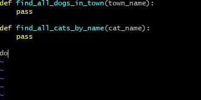 
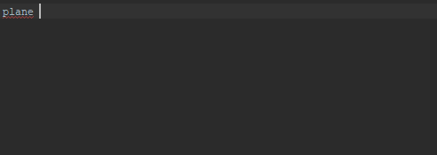
]


<!-- ......................................................................................... -->
---
class: splash middle center

So
--

.huge[With short names  
you _do not_  
_avoid typos_,]
--

.huge[  
you just avoid  
**being understood**.
]
--

.huge[  
Use  
**meaningful** names.
]


<!-- ......................................................................................... -->
---
# Naming: Follow Universal Convention


* .medium[Object, variable, property &rarr; **NOUN**.] 

```python
galaxy = Galaxy()
pilot = crew.Pilot()
```

* .medium[Action, function, method &rarr; **VERB**.]

```python
def feed_klingon(klingon):
    food = get_food_from_locker_for("klingon")
    klingon.eat(food)
```
* .medium[Collection, list, set &rarr; **PLURIAL**. ]

```python
klingons = find_klingons_in_town('groningen')
klingon_names = ['Kitty', 'Sam']
```


<!-- ......................................................................................... -->
---
# Naming: Follow Universal Convention


* .medium[Dictionary, Map : indicate *key* to not be mistaken with collections.]

```python
pilots_by_town['toronto']
country_to_officer_map['NL'] = find_officer_in_country('NL')
```

* .medium[Use _suffix_ if it helps to avoid mistakes  
when your language is dynamically typed.]

```python
startship_list
engine_dict
vulcan_set
```


<!-- ......................................................................................... -->
---
# Naming: Action Name Must Tell What It Does

* If it's about **building**, *tell it*

```python
build_galaxy_map(source)
```

* If it's about **collecting** something, *tell it*

```python
collect_life_forms_from_planets(planets)
```
## Include Useful Informations

```python
find_vulcans_by_name(name)

find_vulcans_by_name_in_planet(name, planet_name)

find_all_vulcans_by_planet_name(planet_name)
```


<!-- ......................................................................................... -->
---

# Naming: Use Antonym To Enclose Action

* .medium[`begin`] &rarr; .medium[`end`]
* .medium[`open`] &rarr; .medium[`close`]
* .medium[`create`] &rarr; .medium[`destroy`]
* .medium[`start`] &rarr; .medium[`stop`]
*  ...

```python
begin_fly()
start_engine()
...
stop_engine()
end_fly()
```
<!-- ......................................................................................... -->
---
# Comments as Readable Informations

## They're mandatory for any public API
* Explain the **what** or the **how**, sometimes the **why**,
* Used by documentation generation and advanced editors.

--

## Event if it's _human-only_ code
* They need _maintainance_ too !

--

## Code never lie, comment sometimes do
* But don't paraphrase code.
* Code remains the truth.


<!-- .......................................................................................... -->
---

class: splash center middle

.quote[
.center[.big[If you need to _improve the comments_  
to _explain the code_,  
**improve code** instead.]]
]

<!-- .......................................................................................... -->
---

class: splash center middle

 Make Code Readable
# 2 - Make Small Well-Targeted Paragraphs

<!-- .......................................................................................... -->
---
class: inverse black_bkg

# Coding is Not Stacking Lines Of Code

<center>
    
</center>

--

.big[Coding is processing _concerns_].

<!--************************************************************************  -->
---
name: group_by_concerns

# Identify And Isolate Concerns

<!--************************************************************************  -->
---
template: group_by_concerns

## A _concern_ is a kind of **WHAT**. 
* a short answer to _"What it Does ?"_

## A _concern_ is not a **HOW**.
* It doesn't answer to _"How it does"_.

???
* a kind of *responsibility* to make it (very) simple.

<!--************************************************************************  -->
---
template: group_by_concerns

## Example of concern

### Starfleet crew is composed of

.outline-code-big[
```yaml
- Commanding Officer
- Navigation Officer
- Chief Of Engineering
- Communication Officer
- Science Officer
```
]

<!--************************************************************************  -->
---
template: group_by_concerns

## Example of concern

### Starfleet crew is composed of

.outline-code-big[
```yaml
*- Commanding Officer
*- Navigation Officer
- Chief Of Engineering
- Communication Officer
- Science Officer
```
]


<!--************************************************************************  -->
---
template: group_by_concerns

## Example of concern

### Theirs concerns are

.outline-code-big[
```yaml
- Commanding Officer 
*            . Make combat decision
*            . Lead starship mission
*            . Do diplomatic talks

- Navigation Officer 
*            . Locate the starship
*            . Compute warp drive coordinates
*            . Update deep space mappings
```
]

--

## You get the idea...

<!--************************************************************************  -->
---
class: splash black_bkg center

# Application to the _StarShip Patrol Procedure_


<center>
    
</center>

--

You want to modify the procedure     
.big[`report_starship_availability_for(patrol)`]  


--

And you're not **satisfied** with what you found.


<!--************************************************************************  -->
---
template: group_by_concerns

## What's you found 


```python
def report_starship_availability_for(patrol):

    rpt = Report()
...
    avg_coms = avg_coms()
    req_qty = p.duration * avg_coms * SEC_COEFF + MIN
    if req_qty > get_nrj() :
        rpt.register('propulsion_energy','NotEnoughEnergy',CRITICAL)

    t_rep = 0
    for eng in get_engs():
        fails = get_fails(engine) 
        t_rep = t_rep + eval_rep_time(eng, fails)
    if t_rep > ( now() - p.departure ):
        rpt.register('engine_check','ReparationTooLong',CRITICAL)
...

    if rpt.find_issues_by_level(CRITICAL) :
        status = NOT_AVAILABLE
    else
        status = evaluate_risks_from_report(rpt)

    rpt.set_status(status)
    return rpt 
 ```

<!--************************************************************************  -->
---
template: group_by_concerns

## Focus on these blocks of code 


```python
def report_starship_availability_for(p):

    report = Report()
...
*   avg_coms = avg_coms()
*   req_qty = p.duration * avg_coms * SEC_COEFF + MIN
*   if req_qty > get_nrj() :
*       rpt.register('propulsion_energy','NotEnoughEnergy',CRITICAL)
*
*   t_rep = 0
*   for eng in get_engs():
*       fails = get_fails(engine) 
*       t_rep = t_rep + eval_rep_time(eng, fails)
*   if t_rep > ( now() - p.departure ):
*       rpt.register('engine_check','ReparationTooLong',CRITICAL)
...

    if report.find_issues_by_level(CRITICAL) :
        status = NOT_AVAILABLE
    else
        status = evaluate_risks_from_report(report)

    report.set_status(status)
    return report 
 ```

<!--************************************************************************  -->
---
template: group_by_concerns

## Identify blocks of code 


```python
...
    avg_coms = avg_coms()
    req_qty = p.duration * avg_coms * SEC_COEFF + MIN
    if req_qty > get_nrj() :
        rpt.register('propulsion_energy','NotEnoughEnergy',CRITICAL)

    t_rep = 0
    for eng in get_engs():
        fails = get_fails(engine) 
        t_rep = t_rep + eval_rep_time(eng, fails)
    if t_rep > ( now() - p.departure ):
        rpt.register('engine_check','ReparationTooLong',CRITICAL)
...
```

--

.medium[_Oh sorry, this is the compressed version..._]

<!--************************************************************************  -->
---
template: group_by_concerns

## Identify blocks of code

```python
...
    average_energy_per_day = get_average_propulsion_energy_consumption_per_day()
    required_energy_level = patrol.duration * average_energy_per_day * SECURITY_COEFF + MINIMAL
    if required_energy_level > get_actual_stocked_energy() :
        report.register('propulsion_energy','NotEnoughEnergy', CRITICAL)

    time_repair = 0
    for engine in get_engines():
        failures = get_failures(engine) 
        time_repair = time_repair + evaluate_reparation_time(engine, failures)
    if time_repair > ( now() - patrol.departure ):
        report.register('engine_check','ReparationTooLong', CRITICAL)
...
```

<!--************************************************************************  -->
---
template: group_by_concerns

## Comments the blocks of code

```python
    #-- Check propulsion energy against patrol duration --
    average_energy_per_day = get_average_propulsion_energy_consumption_per_day()
    required_energy_level = patrol.duration * average_energy_per_day * SECURITY_COEFF + MINIMAL
    if required_energy_level > get_actual_stocked_energy() :
        report.register('propulsion_energy','NotEnoughEnergy', CRITICAL)
        
    #-- Check engines reparation delay against patrol departure -- 
    time_repair = 0
    for engine in get_engines():
        failures = get_failures(engine) 
        time_repair = time_repair + evaluate_reparation_time(engine, failures)
    if time_repair > ( now() - patrol.departure ):
        report.register('engine_check','ReparationTooLong', CRITICAL)
...
```

???

After a little investigation, you found out the mening of these blocks.

<!--************************************************************************  -->
---
template: group_by_concerns

## Comments the blocks of code

```python
*   #-- Check propulsion energy against patrol duration --
    average_energy_per_day = get_average_propulsion_energy_consumption_per_day()
    required_energy_level = patrol.duration * average_energy_per_day * SECURITY_COEFF + MINIMAL
    if required_energy_level > get_actual_stocked_energy() :
        report.register('propulsion_energy','NotEnoughEnergy', CRITICAL)
        
*   #-- Check engines reparation delay against patrol departure -- 
    time_repair = 0
    for engine in get_engines():
        failures = get_failures(engine) 
        time_repair = time_repair + evaluate_reparation_time(engine, failures)
    if time_repair > ( now() - patrol.departure ):
        report.register('engine_check','ReparationTooLong', CRITICAL)
...
```
--

## You have answered to _WHAT ARE THEY DOING ?_ : 
 * _Checking propulsion energy against patrol duration._
 * _Checking engine reparation delay against patrol departure._

<!--************************************************************************  -->
---
template: group_by_concerns

## You have identified two concerns : 

* .medium[`checking propulsion energy against patrol duration`]

```python
*   #-- Check propulsion energy against patrol duration --
    average_energy_per_day = get_average_propulsion_energy_consumption_per_day()
    required_energy_level = patrol.duration * average_energy_per_day * SECURITY_COEFF + MINIMAL
    if required_energy_level > get_actual_stocked_energy() :
        report.register('propulsion_energy','NotEnoughEnergy', CRITICAL)
```
* .medium[`checking engine reparation delay against patrol departure`]

```python
*   #-- Check engines reparation delay against patrol departure --
    time_repair = 0
    for engine in get_engines():
        failures = get_failures(engine) 
        time_repair = time_repair + evaluate_reparation_time(engine, failures)
    if time_repair > ( now() - patrol.departure ):
        report.register('engine_check','ReparationTooLong', CRITICAL)
```

<!--************************************************************************  -->
---
template: group_by_concerns

## Let concerns be isolated as functions

* .medium[`checking propulsion energy against patrol duration`]

```python
def check_propulsion_energy_against_duration(report, patrol_duration):
    average_energy_per_day = get_average_propulsion_energy_consumption_per_day()
    required_energy_level = patrol_duration * average_energy_per_day * SECURITY_COEFF + MINIMAL
    if required_energy_level > get_actual_stocked_energy() :
        report.register('propulsion_energy','NotEnoughEnergy', CRITICAL)
```
* .medium[`checking engine reparation delay against patrol departure`]

```python
def check_engines_reparation_delay_against_departure(report, patrol_departure):
    time_repair = 0
    for engine in get_engines():
        failures = get_failures(engine) 
        time_repair = time_repair + evaluate_reparation_time(engine, failures)
    if time_repair > ( now() - patrol_departure ):
        report.register('engine_check','ReparationTooLong', CRITICAL)
```
<!--************************************************************************  -->
---
template: group_by_concerns

## Let concerns be isolated as functions


.medium[We now can distinguish the **WHAT**...]

```python
*def check_propulsion_energy_against_duration(report, patrol_duration):

    average_energy_per_day = get_average_propulsion_energy_consumption_per_day()
    required_energy_level = patrol_duration * average_energy_per_day * SECURITY_COEFF + MINIMAL
    if required_energy_level > get_actual_stocked_energy() :
        report.register('propulsion_energy','NotEnoughEnergy', CRITICAL)
```
--

.medium[...from the **HOW**]
```python
def check_propulsion_energy_against_duration(report, patrol_duration):

*    average_energy_per_day = get_average_propulsion_energy_consumption_per_day()
*    required_energy_level = patrol_duration * average_energy_per_day * SECURITY_COEFF + MINIMAL
*    if required_energy_level > get_actual_stocked_energy() :
*        report.register('propulsion_energy','NotEnoughEnergy', CRITICAL)
```


<!--************************************************************************  -->
---
template: group_by_concerns

## Used in context 
```python
def report_starship_availability_for(patrol):

    report = Report()
...
    #-- Check propulsion energy against patrol duration --
    check_propulsion_energy_against_duration(report, patrol.duration)

    #-- Check engines reparation delay against patrol departure --
    check_engines_reparation_delay_against_departure(report, patrol.departure)
...

    if report.find_issues_by_level(CRITICAL) :
        status = NOT_AVAILABLE
    else
        status = evaluate_risks_from_report(report)

    report.set_status(status)
    return report 
 ```

???

Does it needs comments to understand ?
<!--************************************************************************  -->
---
template: group_by_concerns

## Used in context 
```python
def report_starship_availability_for(patrol):

    report = Report()
...
    check_propulsion_energy_against_duration(report, patrol.duration)

    check_engines_reparation_delay_against_departure(report, patrol.departure)
...

    if report.find_issues_by_level(CRITICAL) :
        status = NOT_AVAILABLE
    else
        status = evaluate_risks_from_report(report)

    report.set_status(status)
    return report 
 ```

--

Could you read it out loud ? (yes)

<!--************************************************************************  -->

---
name: why_the_separation_of_concern_is_more_satisfying 

# Why the separation of concern is more satisfying ?

.outline-code-medium[

```python

def report_starship_availability_for(patrol):
...
    check_propulsion_energy_against_duration(report, patrol.duration)

    check_engines_reparation_delay_against_departure(report, patrol.departure)
...
```
]

<!--************************************************************************  -->
---
template: why_the_separation_of_concern_is_more_satisfying 

# More readable

--

.outline-code-medium[
```python
def report_starship_availability_for(patrol):
...
    average_energy_per_day = get_average_propulsion_energy_consumption_per_day()
    required_energy_level = patrol.duration * average_energy_per_day * SECURITY_COEFF + MINIMAL
    if required_energy_level > get_actual_stocked_energy() :
        report.register('propulsion_energy','NotEnoughEnergy', CRITICAL)
    time_repair = 0

    for engine in get_engines():
        failures = get_failures(engine) 
        time_repair = time_repair + evaluate_reparation_time(engine, failures)
    if time_repair > ( now() - patrol.departure ):
        report.register('engine_check','ReparationTooLong', CRITICAL)
...
```
]

<!--************************************************************************  -->
---
template: why_the_separation_of_concern_is_more_satisfying 

# More readable

* I can understand **HOW** _the checking of starship systems_ is done _before_ a patrol,
--

 * At first look,
--

 * Without be drowned by details. 
--

 * My brain loves it !

<!--************************************************************************  -->
---
template: why_the_separation_of_concern_is_more_satisfying 

# Responsabilities are well defined
* I can get an clear answer to  
_"What part of code is in charge of this damn propulsion energy level checking ?"_

.outline-code-medium[
```python
* def check_propulsion_energy_against_duration(report, patrol_duration):
    average_energy_per_day = get_average_propulsion_energy_consumption_per_day()
    required_energy_level = patrol_duration * average_energy_per_day * SECURITY_COEFF + MINIMAL
    if required_energy_level > get_actual_stocked_energy() :
        report.register('propulsion_energy','NotEnoughEnergy', CRITICAL)
```
]

<!--************************************************************************  -->
---
template: why_the_separation_of_concern_is_more_satisfying 

# Each part can be more easily tested 
* Instead of running the whole .medium[`report_starship_availability_for`].

.left-column[
.outline-code-medium[
```python
def test_without_energy_level():
    # given 
    mock_it('get_actual_stocked_energy', value=0)

    # when
    check_propulsion_energy_against_duration(report, duration)

    # then
    assert 'propulsion_energy.NotEnoughEnergy' in report
```
]
]

.right-column[
.outline-code-medium[
```python
def test_with_very_long_duration():
    # given 
    duration = 3 * YEAR

    # when
    check_propulsion_energy_against_duration(report, duration)

    # then
    assert 'propulsion_energy.NotEnoughEnergy' in report
```
]
]


<!--************************************************************************  -->
---
class: middle center

# Isolate concerns


???
ISolation of concern is fundamental to help brain to set a name and a meaning over step of processing


<!-- ......................................................................................... -->
---
class: splash middle center

# Principle #3


<!-- ......................................................................................... -->
---
class: splash middle center

Principle #3

# Divid And Conquer
to keep control


<!-- .......................................................................................... -->
---
# Divid And Conquer

## Small is pretty 
* Small and isolated blocks are more easy to change.
* Avoid the God function or class, you know, the block of code where there's everything.

--

## Delimit Responsabilities
* Make well defined components, with a clear set of concerns and managed properties.

--

## Separate Levels Of Abstraction
* Highlight what's important or fundamental in your code.
* Show the intention before the implementation

.center[.big[.quote[We want to limit chain reaction  
and side effect at any change.]]]


<!-- .......................................................................................... -->
---
# Putting Things In Order

## Brain is searching for patterns, create an order before it builds a uncertain one
<center>
    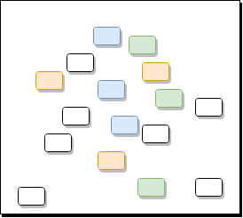
</center>


<!-- .......................................................................................... -->
---
# Putting Things In Order

## Create An Consistent Order Without Dissonance

* Like an house or a workshop, put things in **unsurprising places** if you want people to find them.

<center>
    
</center>

<!-- .......................................................................................... -->
---

# Use Packages, Modules, Namespace

## Enclose responsabilities, 

.outline-code-qbig[
```python
from starship.systems import navigation

from cartography import maps

from crew.roles import navigator

...
```
]

<!-- ..........................................................................................  -->
---

name: use_oop_template

# Use Object Oriented Programming

<!-- ..........................................................................................  -->
---

template: use_oop_template

.quote[Yes I know, it's looking creepy for some people.  ] 

--

.quote[I'm sorry for C++ programmers ]

--

.quote[and OOP current users... ]

--

.quote[But there's a lot of people who dislike OOP, so :) ]

--
.center[.quote[.huge[Let's see OOP  
as way to make efficient smart containers of code  
more easy to maintain. ]]]

<!-- ........................................................................................... -->
---
template: use_oop_template

## After the _"What"_, the _"How"_, try the _"Who"_

* Regroup concerns into the component that answers to   
**Who is in charge of What**

--

.left-column[
.outline-code-medium[
```yaml
- Commanding Officer 
*            . Make combat decision
*            . Lead starship mission
*            . Do diplomatic talks

- Navigation Officer 
*            . Locate the starship
*            . Compute warp drive coordinates
*            . Update deep space mappings

```
]
]

--

.right-column[
.outline-code-medium[
```python
class CommandingOfficer:
    def make_combat_decision(self, situation):
    def lead_starship_mission(self, mission):
    def do_diplomatic_talks(self, situation):

class NavigationOfficer: 
    def locate_starship(self, starship):
    def compute_warp_drive_coordinates(self, starship, coordinates):
    def update_deep_space_mappings(self, nagivation_system):

```
]
]

.reset-column[]


<!-- ..........................................................................................  -->
---
template: use_oop_template
name: cesar

## Group concerns and variables under a same roof

--

```python
engine_status = 'STOPPED'
engine_internal_fan_speed = 0

energy_tank_quantity = 0
energy_tank_status = 'CLOSED'

def start_engine():
     if engine_status == 'STOPPED':
        engine_internal_fan_speed = 2000
        engine_status = 'STARTED'

def open_energy_tank():
    energy_tank_status = 'OPENED'

def add_energy(energy_quantity):
     open_energy_tank()
     energy_tank_quantity = energy_tank_quantity + energy_quantity

...
```
---

template: cesar

```python
*engine_status = 'STOPPED'
*engine_internal_fan_speed = 0

energy_tank_quantity = 0
energy_tank_status = 'CLOSED'

def start_engine():
*    if engine_status == 'STOPPED':
*       engine_internal_fan_speed = 2000
*       engine_status = 'STARTED'

def open_energy_tank():
    energy_tank_status = 'OPENED'

def add_energy(energy_quantity):
     open_energy_tank()
     energy_tank_quantity = energy_tank_quantity + energy_quantity

...
```
---

template: cesar

```python
engine_status = 'STOPPED'
engine_internal_fan_speed = 0

*energy_tank_quantity = 0
*energy_tank_status = 'CLOSED'

def start_engine():
     if engine_status == 'STOPPED':
        engine_internal_fan_speed = 2000
        engine_status = 'STARTED'

def open_energy_tank():
*   energy_tank_status = 'OPENED'

def add_energy(energy_quantity):
     open_energy_tank()
*    energy_tank_quantity = energy_tank_quantity + energy_quantity

...
```
---

template: cesar

```python
*engine_status = 'STOPPED'
*engine_internal_fan_speed = 0

energy_tank_quantity = 0
energy_tank_status = 'CLOSED'

*def start_engine():
     if engine_status == 'STOPPED':
        engine_internal_fan_speed = 2000
        engine_status = 'STARTED'

def open_energy_tank():
    energy_tank_status = 'OPENED'

def add_energy(energy_quantity):
     open_energy_tank()
     energy_tank_quantity = energy_tank_quantity + energy_quantity

...
```
---

template: cesar

```python
*class Engine: 
    def __init__(self):
*       engine_status = 'STOPPED'
*       engine_internal_fan_speed = 0

*   def start_engine(self):
        if engine_status == 'STOPPED':
           engine_internal_fan_speed = 2000
           engine_status = 'STARTED'

energy_tank_quantity = 0
energy_tank_status = 'CLOSED'

def open_energy_tank():
    energy_tank_status = 'OPENED'

def add_energy(energy_quantity):
     open_energy_tank()
     energy_tank_quantity = energy_tank_quantity + energy_quantity

...
```
---

template: cesar

```python
class Engine: 
    def __init__(self):
        self.status = 'STOPPED'
        self.internal_fan_speed = 0

    def start_engine(self):
        if self.status == 'STOPPED':
           self.internal_fan_speed = 2000
           self.status = 'STARTED'

energy_tank_quantity = 0
energy_tank_status = 'CLOSED'

def open_energy_tank():
    energy_tank_status = 'OPENED'

def add_energy(energy_quantity):
     open_energy_tank()
     energy_tank_quantity = energy_tank_quantity + energy_quantity

...
```

---

template: cesar

```python
class Engine: 
    def __init__(self):
        self.status = 'STOPPED'
        self.internal_fan_speed = 0

    def start_engine(self):
        if self.status == 'STOPPED':
           self.internal_fan_speed = 2000
           self.status = 'STARTED'

*energy_tank_quantity = 0
*energy_tank_status = 'CLOSED'

*def open_energy_tank():
    energy_tank_status = 'OPENED'

*def add_energy(energy_quantity):
     open_energy_tank()
     energy_tank_quantity = energy_tank_quantity + energy_quantity

...
```

---

template: cesar

```python
class Engine: 
    def __init__(self):
        self.status = 'STOPPED'
        self.internal_fan_speed = 0

    def start_engine(self):
        if self.status == 'STOPPED':
           self.internal_fan_speed = 2000
           self.status = 'STARTED'

*class EnergyTank:
    def __init__(self):
*        energy_tank_quantity = 0
*        energy_tank_status = 'CLOSED'

*    def open_energy_tank():
        energy_tank_status = 'OPENED'

*    def add_energy(energy_quantity):
         open_energy_tank()
         energy_tank_quantity = energy_tank_quantity + energy_quantity

...
```
---

template: cesar

```python
class Engine: 
    def __init__(self):
        self.status = 'STOPPED'
        self.internal_fan_speed = 0

    def start_engine(self):
        if self.status == 'STOPPED':
           self.internal_fan_speed = 2000
           self.status = 'STARTED'

*class EnergyTank:
    def __init__(self):
*        self.quantity = 0
*        self.status = 'CLOSED'

*    def open_energy_tank(self):
        self.status = 'OPENED'

*    def add_energy(self, energy_quantity):
         self.open_energy_tank()
         self.quantity = self.quantity + energy_quantity

...
```

---

template: cesar

```python
class Engine: 
    def __init__(self):
        self.status = 'STOPPED'
        self.internal_fan_speed = 0

    def start_engine(self):
        if self.status == 'STOPPED':
           self.internal_fan_speed = 2000
           self.status = 'STARTED'

class EnergyTank:
    def __init__(self):
         self.quantity = 0
         self.status = 'CLOSED'

     def open_energy_tank(self):
        self.status = 'OPENED'

     def add_energy(self, energy_quantity):
         self.open_energy_tank()
         self.quantity = self.quantity + energy_quantity

...
```

<!--************************************************************************* -->
---
# Use Composition

## Composition of object reflects your modeling

<center>
    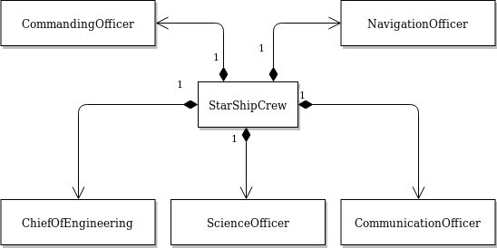
</center>
--

```python
class StarshipCrew:

    def __init__(self):
        self.commanding_officer    = CommandingOfficer()
        self.navigation_officer    = NavigationOfficer()
        self.chief_engineering     = ChiefOfEngineering()
        self.communication_officer = CommunicationOfficer()
        self.science_officer       = ScienceOfficer()


```

<!--************************************************************************* -->
---
name: injection

# Use Injection Pattern To Get Flexible

## Don't let configuration freezed, inject components you want ! 
---
template: injection


```python
class ShuttleCrew:

    def __init__():
        self.pilot    = Pilot()
        self.engineer = Engineer()


```

---
template: injection


```python
class ShuttleCrew:

    def __init__(self, pilot, engineer):
        self.pilot    = pilot
        self.engineer = engineer


```


<!--************************************************************************* -->
---
template: injection

```python
pilot    = Pilot()
engineer = Engineer()

shuttle_crew = ShuttleCrew(pilot, engineer)

assert shuttle_crew.is_ready_to_go(()
```
* Create components from an external point of view and _inject_ them according your needs.
---

template: injection

```python
pilot    = `Expert`Pilot()
engineer = Engineer()

shuttle_crew = ShuttleCrew(pilot, engineer)

assert shuttle_crew.is_ready_to_go(()
```
* Create components from an external point of view and _inject_ them according your needs.

---

template: injection

```python
pilot    = `Drunk`Pilot()
engineer = Engineer()

shuttle_crew = ShuttleCrew(pilot, engineer)

assert shuttle_crew.is_ready_to_go(()
```
* Create components from an external point of view and _inject_ them according your needs.

<!-- ..........................................................................................  -->
---
name: clear_contracts

# Establish Clear Contracts
## So modifying has minimal impact 
---

template: clear_contracts

.reset-column[]

.left-column[
```python
class Engine():
...

  def start(self):
    ...


  def stop(self):
    ...

...
```
]

.right-column[
```python
class PropulsionSystem:
...

    def start_all(self) :
        for engine in self.engines :
            engine.start()

    def stop_all(self) :
        for engine in self.engines :
            engine.stop()
...
```
]

.reset-column[]

---

template: clear_contracts

.reset-column[]

.left-column[
```python
class Engine():
...

* def start(self):
    ...


  def stop(self):
    ...

...
```
]

.right-column[
```python
class PropulsionSystem:
...

    def start_all(self) :
        for engine in self.engines :
*           engine.start()

    def stop_all(self) :
        for engine in self.engines :
            engine.stop()
...
```
]

.reset-column[]

<!-- ..........................................................................................  -->
---

template: clear_contracts

.reset-column[]

.left-column[
```python
class Engine():
...

  def start(self):
    ...


* def stop(self):
    ...

...
```
]

.right-column[
```python
class PropulsionSystem:
...

    def start_all(self) :
        for engine in self.engines :
            engine.start()

    def stop_all(self) :
        for engine in self.engines :
*           engine.stop()
...
```
]

.reset-column[]

---

template: clear_contracts

.reset-column[]

.left-column[
```python
class `QuanticVaccumEngine`(Engine):
...

* def start(self):
    ...


* def stop(self):
    ...

...
```
]

.right-column[
```python
class PropulsionSystem:
...

    def start_all(self) :
        for engine in self.engines :
*           engine.start()

    def stop_all(self) :
        for engine in self.engines :
*           engine.stop()
...
```
]

.reset-column[]

---

template: clear_contracts

### As long as contract is respected

.reset-column[]

.left-column[
```python
class SteamEngine(Engine):
  def start(self):
  def stop(self):

class ForUnitTestEngine(Engine):
  def start(self):
  def stop(self):

class PinaColadaEngine(Engine):
  def start(self):
  def stop(self):

```
]

.right-column[
```python
class PropulsionSystem:
...

    def start_all(self) :
        for engine in self.engines :
*           engine.start()

    def stop_all(self) :
        for engine in self.engines :
*           engine.stop()
...
```
]

.reset-column[]

<!-- ..........................................................................................  -->
---
class: middle center

Brief...
--

# Take Time To Use Object Oriented Programming
--

## It Really Make Code Easier to Maintain
--

### And To Test...


<!--************************************************************************  -->
---
name: separate_levels_of_abstractions

# Separate Levels Of Abstraction

<!--************************************************************************  -->
---
template: separate_levels_of_abstractions

## All blocks of code are not equal 
They have not the same 
 * **importance**,
 * **scope**,
 * **granularity of detail**.

--


## They are all needed, but not at the same level.
* Mixing them up blures the reading of code


<!--************************************************************************  -->
---
class: splash black_bkg center

# Application to the _StarShip Patrol Procedure_


<center>
    
</center>

--

After a little bit of refactoring   
.medium[`report_starship_availability_for(patrol)`]  
you get


<!--************************************************************************  -->
---
template: separate_levels_of_abstractions

```python
def report_starship_availability_for(patrol):

    report = Report()

    check_weapon_system(report, patrol)

    check_propulsion_energy_against_duration(report, patrol.duration)

    check_engines_reparation_delay_against_departure(report, patrol.departure)

    check_navigation_system(report, patrol)

    if report.find_issues_by_level(CRITICAL) :
        status = NOT_AVAILABLE
    else
        status = evaluate_risks_from_report(report)

    report.set_status(status)
    return report 
```

<!--************************************************************************  -->
---
template: separate_levels_of_abstractions

## Are all function to the same level of abstraction ?

```python
def report_starship_availability_for(patrol):

    report = Report()

    check_weapon_system(report, patrol)

    check_propulsion_energy_against_duration(report, patrol.duration)

    check_engines_reparation_delay_against_departure(report, patrol.departure)

    check_navigation_system(report, patrol)

    if report.find_issues_by_level(CRITICAL) :
        status = NOT_AVAILABLE
    else
        status = evaluate_risks_from_report(report)

    report.set_status(status)
    return report 
```

<!--************************************************************************  -->
---
template: separate_levels_of_abstractions

.medium[`report_starship_availability_for`] &rarr; level **N** (higher)

```python
def `report_starship_availability_for`(patrol):

    report = Report()

    check_weapon_system(report, patrol)

    check_propulsion_energy_against_duration(report, patrol.duration)

    check_engines_reparation_delay_against_departure(report, patrol.departure)

    check_navigation_system(report, patrol)

    if report.find_issues_by_level(CRITICAL) :
        status = NOT_AVAILABLE
    else
        status = evaluate_risks_from_report(report)

    report.set_status(status)
    return report 
```

```
*- report_starship_availability_for 
```

<!--************************************************************************  -->
---
template: separate_levels_of_abstractions

This block &rarr; .medium[`evaluate_availability`] &rarr; level **N - 1**

```python
def report_starship_availability_for(patrol):

    report = Report()

    check_weapon_system(report, patrol)

    check_propulsion_energy_against_duration(report, patrol.duration)

    check_engines_reparation_delay_against_departure(report, patrol.departure)

    check_navigation_system(report, patrol)

*   if report.find_issues_by_level(CRITICAL) :
*       status = NOT_AVAILABLE
*   else
*       status = evaluate_risks_from_report(report)
*
*   report.set_status(status)
    return report 
```

```
- report_starship_availability_for 
```


<!--************************************************************************  -->
---
template: separate_levels_of_abstractions

This block &rarr; .medium[`evaluate_availability`] &rarr; level **N - 1**

```python
def report_starship_availability_for(patrol):

    report = Report()

    check_weapon_system(report, patrol)

    check_propulsion_energy_against_duration(report, patrol.duration)

    check_engines_reparation_delay_against_departure(report, patrol.departure)

    check_navigation_system(report, patrol)

    `evaluate_availability`(report) :
                              
*       
*                                                  
*
*                            
    return report 
```

```
- report_starship_availability_for
*           +-- evaluate_availability 
```


<!--************************************************************************  -->
---
template: separate_levels_of_abstractions

Here we are

```python
def report_starship_availability_for(patrol):

    report = Report()

    check_weapon_system(report, patrol)

    check_propulsion_energy_against_duration(report, patrol.duration)

    check_engines_reparation_delay_against_departure(report, patrol.departure)

    check_navigation_system(report, patrol)

    evaluate_availability(report)

    return report 
    ...
```

```
- report_starship_availability_for  
            +-- evaluate_availability
```


<!--************************************************************************  -->
---
template: separate_levels_of_abstractions

These 2 are just fine under .medium[`report_starship_availability_for`] &rarr; level **N - 1**

```python
def report_starship_availability_for(patrol):

    report = Report()

    `check_weapon_system`(report, patrol)

    check_propulsion_energy_against_duration(report, patrol.duration)

    check_engines_reparation_delay_against_departure(report, patrol.departure)

    `check_navigation_system`(report, patrol)

    evaluate_availability(report)

    return report 
    ...
```

```
- report_starship_availability_for  
*           +-- check_weapon_system
*           +-- check_navigation_system               
            +-- evaluate_availability
```

<!--************************************************************************  -->
---
template: separate_levels_of_abstractions

These 2 are very specific to _Propulsion Systems checking_ &rarr; level **N-2**

```python
def report_starship_availability_for(patrol):

    report = Report()

    check_weapon_system(report, patrol)

    `check_propulsion_energy_against_duration`(report, patrol.duration)

    `check_engines_reparation_delay_against_departure`(report, patrol.departure)

    check_navigation_system(report, patrol)

    evaluate_availability(report)

    return report 
```

```
- report_starship_availability_for  
            +-- check_weapon_system
            +-- check_navigation_system
            +-- evaluate_availability
```


<!--************************************************************************  -->
---
template: separate_levels_of_abstractions

Create a new .medium[`check_propulsion_system`] &rarr; level **N-1**

```python
def report_starship_availability_for(patrol):

    report = Report()

    check_weapon_system(report, patrol)

    `check_propulsion_energy_against_duration`(report, patrol.duration)

    `check_engines_reparation_delay_against_departure`(report, patrol.departure)

    check_navigation_system(report, patrol)

    evaluate_availability(report)

    return report 
```

```
- report_starship_availability_for  
            +-- check_weapon_system
            +-- check_navigation_system
*           +-- check_propulsion_system              
            +-- evaluate_availability
```


<!--************************************************************************  -->
---
template: separate_levels_of_abstractions

Move these 2 under the new .medium[`check_propulsion_system`]

```python
def report_starship_availability_for(patrol):

    report = Report()

    check_weapon_system(report, patrol)

    `check_propulsion_energy_against_duration`(report, patrol.duration)

    `check_engines_reparation_delay_against_departure`(report, patrol.departure)

    check_navigation_system(report, patrol)

    evaluate_availability(report)

    return report 
```

```
- report_starship_availability_for  
            +-- check_weapon_system
            +-- check_navigation_system
            +-- check_propulsion_system              
*                           +-- check_propulsion_energy_against_duration
*                           +-- check_engines_reparation_delay_against_departure
            +-- evaluate_availability
```


<!--************************************************************************  -->
---
template: separate_levels_of_abstractions

Move these 2 under the new .medium[`check_propulsion_system`] &rarr; level **N-1**
```python
def report_starship_availability_for(patrol):

    report = Report()

    check_weapon_system(report, patrol)

    `check_propulsion_system`(report, patrol.duration)

*    

*    

    check_navigation_system(report, patrol)

    evaluate_availability(report)

    return report 
```

```
- report_starship_availability_for  
            +-- check_weapon_system
            +-- check_navigation_system
*           +-- check_propulsion_system              
*                            +-- check_propulsion_energy_against_duration
*                            +-- check_engines_reparation_delay_against_departure
            +-- evaluate_availability
```
<!--************************************************************************  -->
---
template: separate_levels_of_abstractions

Move these 2 under the new .medium[`check_propulsion_system`] &rarr; level **N-1**
```python
def report_starship_availability_for(patrol):

    report = Report()

    check_weapon_system(report, patrol)

    `check_propulsion_system`(report, patrol)

    check_navigation_system(report, patrol)

    evaluate_availability(report)

    return report 
```

```
- report_starship_availability_for  
            +-- check_weapon_system
            +-- check_navigation_system
*           +-- check_propulsion_system              
                            +-- check_propulsion_energy_against_duration
                            +-- check_engines_reparation_delay_against_departure
            +-- evaluate_availability
```


<!--************************************************************************  -->
---
template: separate_levels_of_abstractions

Here we are
```python
def report_starship_availability_for(patrol):

    report = Report()

    check_weapon_system(report, patrol)

    check_propulsion_system(report, patrol)

    check_navigation_system(report, patrol)

    evaluate_availability(report)

    return report 
```

```
- report_starship_availability_for  
            +-- check_weapon_system
            +-- check_navigation_system
            +-- check_propulsion_system              
                            +-- check_propulsion_energy_against_duration
                            +-- check_engines_reparation_delay_against_departure
            +-- evaluate_availability
```

<!--************************************************************************  -->
---
template: separate_levels_of_abstractions

Finaly these can be grouped in a new .medium[`check_starship_systems`] &rarr; level **N-1**

```python
def report_starship_availability_for(patrol):

    report = Report()

    `check_weapon_system`(report, patrol)

    `check_propulsion_system`(report, patrol)

    `check_navigation_system`(report, patrol)

    evaluate_availability(report)

    return report 
```

```
- report_starship_availability_for  
            +-- check_weapon_system
            +-- check_navigation_system
            +-- check_propulsion_system              
                            +-- check_propulsion_energy_against_duration
                            +-- check_engines_reparation_delay_against_departure
            +-- evaluate_availability
```


<!--************************************************************************  -->
---
template: separate_levels_of_abstractions

Finaly these can be grouped in a new .medium[`check_starship_systems`] &rarr; level **N-1**

```python
def report_starship_availability_for(patrol):

    report = Report()

    `check_weapon_system`(report, patrol)

    `check_propulsion_system`(report, patrol)

    `check_navigation_system`(report, patrol)

    evaluate_availability(report)

    return report 
```

```
- report_starship_availability_for  
*           +-- check_starship_systems
            +-- check_weapon_system
            +-- check_navigation_system
            +-- check_propulsion_system              
                            +-- check_propulsion_energy_against_duration
                            +-- check_engines_reparation_delay_against_departure
            +-- evaluate_availability
```

<!--************************************************************************  -->
---
template: separate_levels_of_abstractions

Finaly these can be grouped in a new .medium[`check_starship_systems`] &rarr; level **N-1**

```python
def report_starship_availability_for(patrol):

    report = Report()

    `check_starship_systems`(report, patrol)

*

* 

    evaluate_availability(report)

    return report 
```

```
- report_starship_availability_for  
            +-- check_starship_systems
*                    +-- check_weapon_system
*                    +-- check_navigation_system
*                    +-- check_propulsion_system              
*                                    +-- check_propulsion_energy_against_duration
*                                    +-- check_engines_reparation_delay_against_departure
*       
            +-- evaluate_availability
```

<!--************************************************************************  -->
---
template: separate_levels_of_abstractions

Finaly these can be grouped in a new .medium[`check_starship_systems`] &rarr; level **N-1**

```python
def report_starship_availability_for(patrol):

    report = Report()

    `check_starship_systems`(report, patrol)

    evaluate_availability(report)

    return report 
```

```
- report_starship_availability_for  
            +-- check_starship_systems
*                    +-- check_weapon_system
*                    +-- check_navigation_system
*                    +-- check_propulsion_system              
*                                    +-- check_propulsion_energy_against_duration
*                                    +-- check_engines_reparation_delay_against_departure
*       
            +-- evaluate_availability
```

<!--************************************************************************  -->
---
template: separate_levels_of_abstractions

So we end with : 

```python
def report_starship_availability_for(patrol):

    report = Report()

    check_starship_systems(report, patrol)

    evaluate_availability(report)

    return report 
```

```
- report_starship_availability_for  
            +-- check_starship_systems
                     +-- check_weapon_system
                     +-- check_navigation_system
                     +-- check_propulsion_system              
                                     +-- check_propulsion_energy_against_duration
                                     +-- check_engines_reparation_delay_against_departure
        
            +-- evaluate_availability
```


<!--************************************************************************  -->
---
template: separate_levels_of_abstractions

* Level N of Abstraction

```python
def report_starship_availability_for(patrol):

    report = Report()
    check_starship_systems(report, patrol)
    evaluate_availability(report)

    return report 
```

* Level N - 1 of Abstraction

```python
def check_starship_systems(report, patrol):
    report = Report()

    check_weapon_system(report, patrol)
    check_propulsion_system(report, patrol)
    check_navigation_system(report, patrol)
```

* Level N - 2 of Abstraction

```python
def check_propulsion_system(report, patrol):
    check_propulsion_energy_against_duration(report, patrol.duration)
    check_engines_reparation_delay_against_departure(report, patrol.departure)
```

<!--************************************************************************  -->
---
template: separate_levels_of_abstractions

* Level N of Abstraction

```python
def report_starship_availability_for(patrol):

    report = Report()
*   check_starship_systems(report, patrol)
    evaluate_availability(report)

    return report 
```

* Level N - 1 of Abstraction

```python
*def check_starship_systems(report, patrol):
    report = Report()

    check_weapon_system(report, patrol)
    check_propulsion_system(report, patrol)
    check_navigation_system(report, patrol)
```

* Level N - 2 of Abstraction

```python
def check_propulsion_system(report, patrol):
    check_propulsion_energy_against_duration(report, patrol.duration)
    check_engines_reparation_delay_against_departure(report, patrol.departure)
```

<!--************************************************************************  -->
---
template: separate_levels_of_abstractions

* Level N of Abstraction

```python
def report_starship_availability_for(patrol):

    report = Report()
    check_starship_systems(report, patrol)
    evaluate_availability(report)

    return report 
```

* Level N - 1 of Abstraction

```python
def check_starship_systems(report, patrol):
    report = Report()

    check_weapon_system(report, patrol)
*   check_propulsion_system(report, patrol)
    check_navigation_system(report, patrol)
```

* Level N - 2 of Abstraction

```python
*def check_propulsion_system(report, patrol):
    check_propulsion_energy_against_duration(report, patrol.duration)
    check_engines_reparation_delay_against_departure(report, patrol.departure)
```

<!--************************************************************************  -->
---
name: chaining_how_what_as_scale

template: separate_levels_of_abstractions

## The WHAT &rarr; HOW relation as abstraction scale

<!--************************************************************************  -->
---
template: chaining_how_what_as_scale

.outline-code-qbig[
```yaml
report_starship_availability_for
            | 
            +-- check_weapon_system
            | 
            +-- check_navigation_system
            | 
            +-- check_propulsion_system              
                            | 
                            +-- check_propulsion_energy_against_duration
                            |
                            +-- check_engines_reparation_delay_against_departure

            +-- evaluate_availability 
```
]

<!--************************************************************************  -->
---
template: chaining_how_what_as_scale

.outline-code-qbig[
```yaml
*-(WHAT)-> report_starship_availability_for
            | 
            +- check_weapon_system
            | 
            +- check_navigation_system
            | 
            +- check_propulsion_system              
                            | 
                            +- check_propulsion_energy_against_duration
                            |
                            +- check_engines_reparation_delay_against_departure

            +-- evaluate_availability 
```
]

<!--************************************************************************  -->
---
template: chaining_how_what_as_scale

.outline-code-qbig[
```yaml
-(WHAT)-> report_starship_avilability_for
            | 
*         (HOW)
            |
            v 
            +- check_weapon_system
            | 
            +- check_navigation_system
            | 
            +- check_propulsion_system              
                            | 
                            +- check_propulsion_energy_against_duration
                            |
                            +- check_engines_reparation_delay_against_departure
            +-- evaluate_availability 
```
]

<!--************************************************************************  -->
---
template: chaining_how_what_as_scale

.outline-code-qbig[
```yaml
-(WHAT)-> report_starship_availability_for
            | 
          (HOW)
            |
            v 
*           +-(WHAT)-> check_weapon_system
            | 
*           +-(WHAT)-> check_navigation_system
            | 
*           +-(WHAT)-> check_propulsion_system              
                            | 
                            +- check_propulsion_energy_against_duration
                            |
                            +- check_engines_reparation_delay_against_departure
*           +-(WHAT)- evaluate_availability 
```
]


<!--************************************************************************  -->
---
template: chaining_how_what_as_scale

.outline-code-qbig[
```yaml
-(WHAT)-> report_starship_availability_for
            | 
          (HOW)
            |
            v 
            +-(WHAT)-> check_weapon_system
            | 
            +-(WHAT)-> check_navigation_system
            | 
            +-(WHAT)-> check_propulsion_system              
                            | 
*                         (HOW)
                            |
                            v 
                            +- check_propulsion_energy_against_duration
                            |
                            +- check_engines_reparation_delay_against_departure
            +-(WHAT)- evaluate_availability 
```
]

<!--************************************************************************  -->
---
template: chaining_how_what_as_scale

.outline-code-qbig[
```yaml
-(WHAT)-> report_starship_availability_for
            | 
          (HOW)
            |
            v 
            +-(WHAT)-> check_weapon_system
            | 
            +-(WHAT)-> check_navigation_system
            | 
            +-(WHAT)-> check_propulsion_system              
                            | 
                          (HOW)
                            |
                            v 
*                           +-(WHAT)-> check_propulsion_energy_against_duration
                            |
*                           +-(WHAT)-> check_engines_reparation_delay_against_departure
            +-(WHAT)- evaluate_availability 
```
]

<!--************************************************************************  -->
---
template: chaining_how_what_as_scale

.outline-code-qbig[
```yaml
-(WHAT)-----+
            | 
          (HOW)
            |
            v 
            +-----(WHAT)----+               
                            | 
                          (HOW)
                            |
                            v 
                            +-----(WHAT)----+ 
                                            | 
                                          (HOW)
                                            |
                                            v 
                                            +-(WHAT)-> ...
```
]

<!--************************************************************************  -->
---
template: chaining_how_what_as_scale

.outline-code-qbig[
```yaml
-(WHAT)-----+
            | 
          (HOW)
            |
            v 
            +-----(WHAT)----+               
                            | 
                          (HOW)
                            |
                            v 
                            +-----(WHAT)----+ 
                                            | 
                                          (HOW)
                                            |
                                            v 
                                            +-(WHAT)-> ...

<`Fundamental/General`> ---------------- < Specific/Detailled > 
```
]

<!--************************************************************************  -->
---
template: chaining_how_what_as_scale

.outline-code-qbig[
```yaml
-(WHAT)-----+
            | 
          (HOW)
            |
            v 
            +-----(WHAT)----+               
                            | 
                          (HOW)
                            |
                            v 
                            +-----(WHAT)----+ 
                                            | 
                                          (HOW)
                                            |
                                            v 
                                            +-(WHAT)-> ...

<`Fundamental/General`> ---------------- <`Specific/Detailled`> 
```
]

<!--************************************************************************  -->
---
template: chaining_how_what_as_scale

.outline-code-qbig[
```yaml
-(WHAT)-----+
    .       | 
    .     (HOW)
    .       |
    .       v 
    .       +-----(WHAT)----+               
    .                .      | 
    .                .    (HOW)
    .                .      |
    .                .      v 
    .                .      +-----(WHAT)----+ 
    .                .               .      | 
    .                .               .    (HOW)
    .                .               .      |
    .                .               .      v 
    .                .               .      +-(WHAT)-> ...
    .                .               .           .
    N                N-1            N-2         N-3

```
]


<!--************************************************************************  -->

---
name: why_the_separate_levels_of_abstractions_is_more_satisfying 

# Why The Separation Of Levels Of Abstractions is More Satisfying ?


<!--************************************************************************  -->
---
template: why_the_separate_levels_of_abstractions_is_more_satisfying

## Increased accessibility
* I can __zoom into__ details or __zoom out__ to get a big picture,

--

## Intention Before Implementation
* I can understand **WHAT** the code is supposed to do _before_ **HOW** it does.

--

## Increased Analyzability and Modifiyability
* I can _more_ easily evaluate impact of modification according to abstraction level

<!--************************************************************************  -->
---
template: why_the_separate_levels_of_abstractions_is_more_satisfying

## Increased Testability

* Test **per abstraction level** with components of the same level or under.

--

## Test upper logic before implementing details  

* Test __intention__ logic before __implementation__ logic


.reset-column[]

.left-column[
.small[_Test at **N** Level_]
.outline-code-medium[
```python
def test_check_starship_systems_return_critical_issue():
    # given 
    report = Report()
    report.register('Foo', 'Bar', CRITICAL)
*   mock_it('check_starship_systems', value = report)

    # when
    report_starship_availability_for(patrol)

    # then
    assert report.status == NOT_READY
```
]
]

--

.right-column[
.small[_Test at **N-1** Level_]
.outline-code-medium[
```python
def test_check_propulsion_systems_return_critical_issue():
    # given 
    report = Report()
    report.register('Foo', 'Bar', CRITICAL)
    mock_it('check_propulsion_system', value = report)

    # when
*    check_starship_systems(report,patrol)

    # then
    assert find_issues_by_level(CRITICAL)
```
]
]


<!--************************************************************************  -->
---
template: separate_levels_of_abstractions

<center>
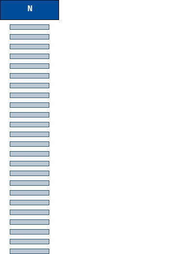
</center>


???
The separation of level of abstraction allow you to distinguish
the levels of processing.

It's like a hierarchy of details or importance.
Each level has to communicate and interact with component of the same level ou the next level.


<!-- .......................................................................................... -->
---
class: splash 

# .center[Golden Rule For Function]

--

.quote[.center[.big[Functions should **do one thing.**  
They should do it **well**.  
They should do it **only**.  ]]]  
--

.quote[.center[.big[... by abstraction level]]]

<!-- .......................................................................................... -->
---
class: splash 

# .center[Golden Rule For Function]


.reset-column[]

.left-column[
```python
def engine_start():
    engine_status = 'STARTED'
*    if not engine_logger :
*       FORMAT = '%(asctime)-15s %(message)s'
*       logging.basicConfig(format=FORMAT)
*       engine_logger = logging.getLogger('engine')
    engine_logger.info('Engine started')
    engine_power = 0.1


...        
```
.center[.small[It takes in charge an logger creation while  
we expect it just starts the engine.]
]]

--

.right-column[
```python


def engine_start():
    engine_status = 'STARTED'
*   log_info('Engine started')
    engine_power = 0.1
```
.center[.small[It starts the engine and **delegates**   
the logging problem to lower functions.]
]]

.reset-column[]

<!-- .......................................................................................... -->
---
class: splash 

# .center[Golden Rule For Function]


.reset-column[]

.left-column[
```python
def engine_start():
    engine_status = 'STARTED'
*    if not engine_logger :
*       FORMAT = '%(asctime)-15s %(message)s'
*       logging.basicConfig(format=FORMAT)
*       engine_logger = logging.getLogger('engine')
    engine_logger.info('Engine started')
    engine_power = 0.1


...        
```
.center[.small[It takes in charge an logger creation while  
we expect it just starts the engine.]
]]


.right-column[
```python
def get_logger():
    if not engine_logger :
       FORMAT = '%(asctime)-15s %(message)s'
       logging.basicConfig(format=FORMAT)
       engine_logger = logging.getLogger('engine')
    return engine_logger

def log_info(msg):
    get_logger().info(msg)    

def engine_start():
    engine_status = 'STARTED'
*   log_info('Engine started')
    engine_power = 0.1
```
.center[.small[It starts the engine and **delegates**   
the logging problem to lower functions.]
]]

.reset-column[]

???

You're thinking its a scan, but it starts engine too !


<!-- ......................................................................................... -->
---
class: splash middle center

# Principle #4


<!-- ......................................................................................... -->
---
class: splash middle center

Principle #4

# Don't Believe, Test

<!-- ......................................................................................... -->
---
# Do Not Demand To Believe

## Show Evidence, Show The Tests
* **Executable** test are self-explanatory
* They show **what** each piece of code is __supposed__ to do.

## Automatic Testing is Not an extra
* It's a deliverable and part of the job, sometime up to 50%.
* In some project, as Apache Foundation, any change without automatic test is just ignored.


???
Don't ask people to have faith in code, make them to trust your code.


<!-- ......................................................................................... -->
---
class: center black_bkg splash

# Maintaining Code Without Test is Hazardous

<center>
    
</center>

.big[.quote[Its like trying to land an aircraft in the dark  ]]  
--

.big[.quote[without instrument or light.  ]]  


???
https://www.reddit.com/r/flightsim/comments/7gw6hf/night_landings_of_xplane_11_are_so_gorgeous/
Would you ask the pilot of your plane just to believe he could suced to land safely ? 

<!-- ......................................................................................... -->
---
class: splash center

# Automatic Tests Are Like a Safety Net

## They make you free to risk to change the code

<center>
    
</center>

???
https://www.flickr.com/photos/skuds/

Without safety net, you even try to think about modification.

Tests let you try without the fear of side effects


<!-- ......................................................................................... -->
---
class: center

# Continous Testing Allows You To Move Safely


<center>
    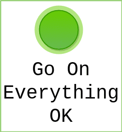
</center> 


???
Set your tool such as any modification runs unit test
As soon as a test is broken, you know you are out off the road.


<!-- ........................................................................................ -->
---
# Tests Are A Capital With Interests

## Accumulate Them And Make Confidence Stronger
* Each new unit test is added to old ones, making you more confident to create another.
* The capital of tests executed at each modification grows. 

<center>
    
</center>

???
Test after test, you create a amount of test that are executed at each modification 

<!-- ......................................................................................... -->
---
class: splash middle center

# Testability Reveals The Design

.center[.huge[.quote[A code that cannot be easily tested is poorly designed.]]]

--

-------

.center[.huge[.quote[Refactor the code until it can be tested.]]]


???

More than the act of testing, the act of designing tests is one of the best bug preventers known


<!-- ......................................................................................... -->
---
name: test_101


# Unit Test 101


<!-- ......................................................................................... -->
---
template: test_101

## Use _Given-When-Then_ pattern

--

.center[.huge[.quote[**Given**]]  
.big[.quote[a situation]]]  
--

.center[.huge[.quote[**When**]]  
.big[.quote[component **does** something]]]  
--

.center[.huge[.quote[**Then**]]  
.big[.quote[check results are as **expected**]]]


<!-- ......................................................................................... -->
---
template: test_101

## Use _Given-When-Then_ pattern

.outline-code-big[
```python
def test_klingon_hungry_is_angry():
    # ------ given ------ 
    food_quantity = 0

    # ------ when -------
    klingon.eat(food_quantity)

    # ----- then --------
    assert klingon.is_angry() 
```
]


<!-- ......................................................................................... -->
---
template: test_101

## Use _Given-When-Then_ pattern

.outline-code-big[
```python
def test_klingon_hungry_is_angry():
*   # ------ given ------ 
*   food_quantity = 0

    # ------ when -------
    klingon.eat(food_quantity)

    # ----- then --------
    assert klingon.is_angry() 
```
]

<!-- ......................................................................................... -->
---
template: test_101

## Use _Given-When-Then_ pattern

.outline-code-big[
```python
def test_klingon_hungry_is_angry():
    # ------ given ------ 
    food_quantity = 0

*   # ------ when -------
*   klingon.eat(food_quantity)

    # ----- then --------
    assert klingon.is_angry() 
```
]

<!-- ......................................................................................... -->
---
template: test_101

## Use _Given-When-Then_ pattern

.outline-code-big[
```python
def test_klingon_hungry_is_angry():
    # ------ given ------ 
    food_quantity = 0

    # ------ when -------
    klingon.eat(food_quantity)

*   # ----- then --------
*   assert klingon.is_angry() 
```
]

<!-- ......................................................................................... -->
---
template: test_101

.left-column[
## Don't test everything
* Test **critical** and **non trivial** parts. 
]

???
Don't lose your time to test trivial code as accessors, getter and setter.

--

.left-column[
## Tests must be independent from each other
* and passed in any order or unitarily.
]
--

.left-column[
## Test must fail first 
* until the code make it successful
]
--

.left-column[
## Test is code too 
* Use the same principles than regular code.
]

???
Test proofs you're doing well, so make it change from _failed_ to _success_.


<!-- ......................................................................................... -->
---
class: splash middle center

# Principle #5

<!-- ......................................................................................... -->
---

class: splash middle center

Principle #5
# Empower yourself

Get equiped

<!-- ......................................................................................... -->
---
name: dont_be_afraid

# Don't Be Afraid Of Refactoring

.left-column[
.center[
## Code is not a fragile building 
]

<center>
    
</center>
]

???
If you have a good design, follow strong principles, your code is not a fragile building.

--

.right-column[
.center[
## Code is like bread drough
]

<center>
    
</center>
]


.reset-column[]

???
* You have to reshape, cut off, make parts at any time.


--

.center[.medium[.quote[If you can not  ]]]
--

.center[.big[.quote[rename a variable, move a function, or change its arguments  ]]]
--

.center[.medium[.quote[and so on...  ]]]
--

.center[.huge[.quote[because it's not **so easy**.  ]]]
--

.center[.quote[Well  ]]
--

.center[.huge[.quote[you are just **under equipped.**]]]

---


# Take Advantage of the Tools

## Don't try to keep everything in your mind
* You are overloading yourself unnecessarily.

<center>
    
</center>

<!-- ......................................................................................... -->
---
name: use_powerful_editor

# Use a Powerful Editor

---
template: use_powerful_editor

## The best editor is the one we master, but...
1. Take time to **actually** master it
1. Take a look at others

--

## Go beyond the simple text editor
* .big[.quote["I know a man who make great code with a simple text editor !"]]
--

* .big[.quote["I know a man who make complex computation with an abacus."]]
--

* .big[.quote["It's possible, but there's more efficient."]]


<!-- .......................................................................................... -->
---
template: use_powerful_editor


- &#9744;  **Language helper**
   * &#9744; Syntax Highlight and Auto-completion
   * &#9744; Permanent code analyzer ( _linter_ )
--

- &#9744;  **Easy visual Debugging** 
   * &#9744; step-by-step
   * &#9744; with value exploration and modification on-fly
--

- &#9744;  **Refactoring**
   * &#9744; rename (variable, function, method, class, package, ...)
   * &#9744; change signature (parameter, name and order)
   * &#9744; move (variable, function, method, class, package, ...)
--

- &#9744;  **Navigation**
   * &#9744; Outline (structure display)
   * &#9744; Jump to definition, declaration, instantiation, ...
   * &#9744; Usages

<!-- .......................................................................................... -->
---
template: use_powerful_editor

## Good editor keep all references in mind
* It's **faster** and more **efficient** than you.
* It builds a up-to-date index of everything (symbol, function, class, ...)
* **It's updated at each pull from GIT repository**

--

## Example of such capacities

---
## As renaming a variable

<center>
    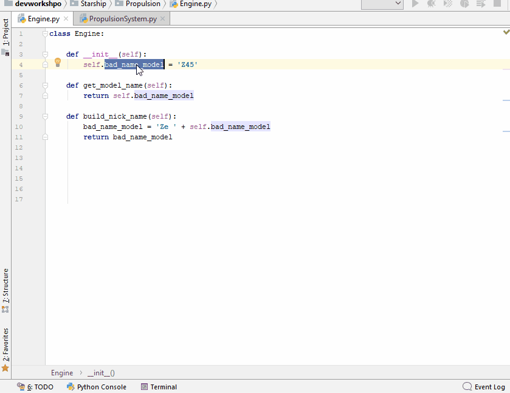
</center>

---
## As renaming a function

<center>
    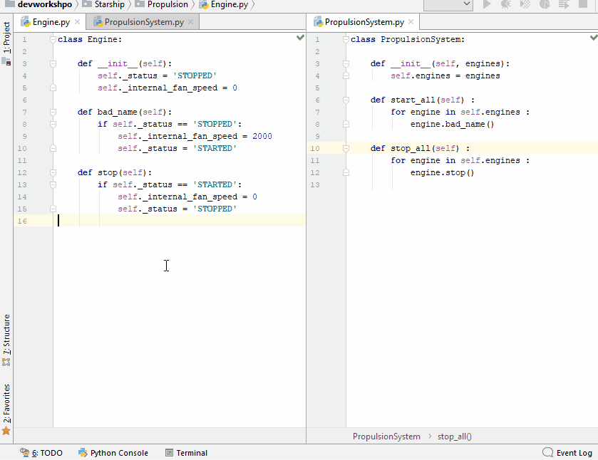
</center>


---
## As changing signature

<center>
    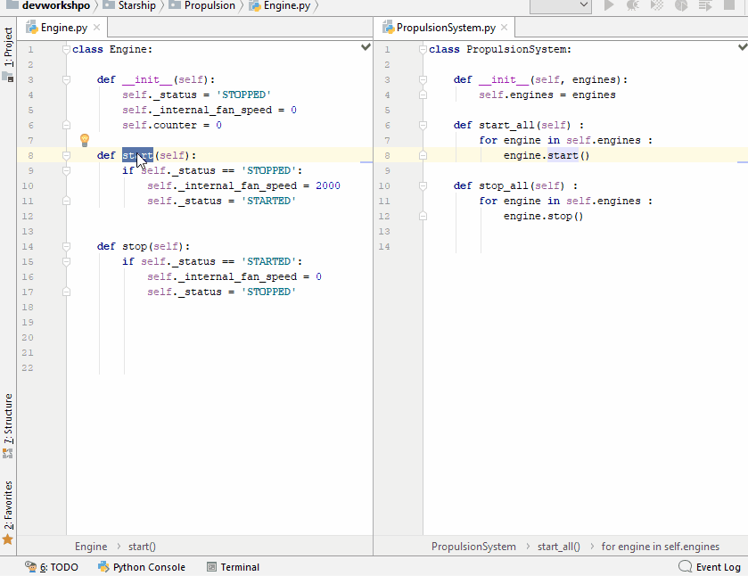
</center>


---
## As moving function

<center>
    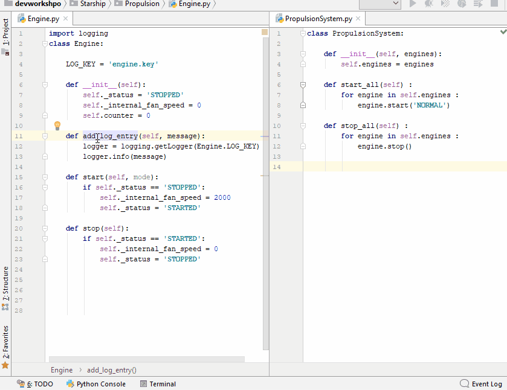
</center>

<!-- ........................................................................................ -->
---
# Stay tuned on your sonar rules

## Use _Sonarlint_

<center>
    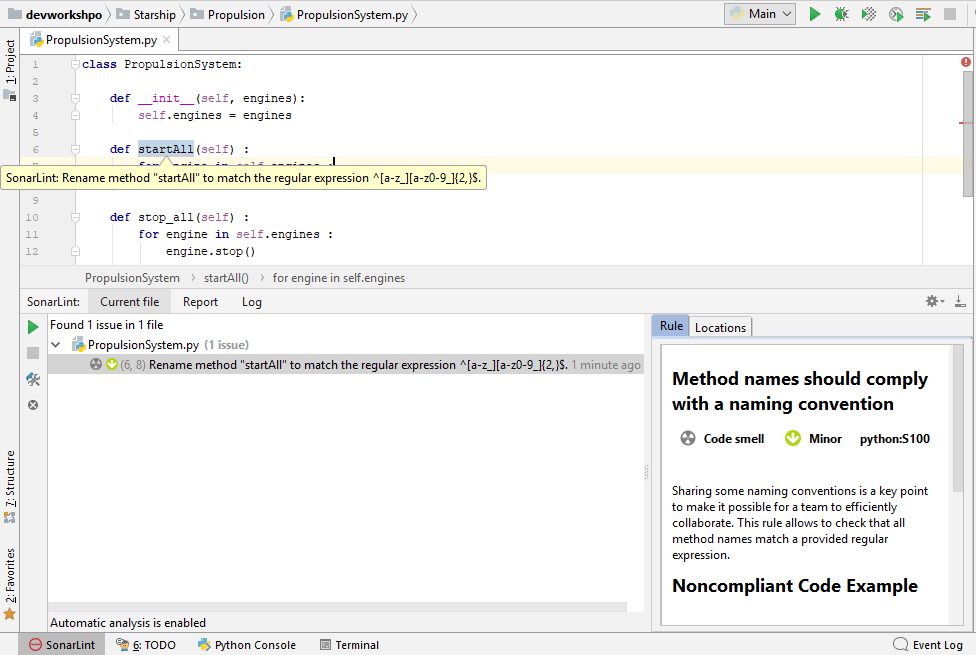
</center>

* For future version of Sonar ?

---
class:  inverse middle center
# Last principle
--

.hug[.quote[Don't Stay Alone]]

--

.left[
* Exchange with other Euclid developers
 * on forum https://euclid.roe.ac.uk/projects/codeen-users/boards
 * on mailing list developers@lists.euclid-ec.org
 * on slack https://euclid-at-cc.slack.com/ (unofficial ?)
]
<!-- ......................................................................................... -->
---
class: inverse middle center

# Conclusion
## Code For Human
## Make The Code Readable
## Divid And Conquer To Keep Control
## Don't Believe, Test
## Empower Yourself
## Don't Stay Alone


<!-- ......................................................................................... -->
---

class: splash center
# Code for Human


.center[ .huge[
Always code as  
if the person  
who ends up maintaining your code  
is a violent **psychopath**  
who knows where you live.]]


<!-- ......................................................................................... -->
---

class: splash center
# Code for Human


<!-- ----------------------------------------------------------------------------------------- -->
---
# Thank You and references

* Presentation framework : https://github.com/gnab/remark  
 * Thanks Alexandre :)

* Drawings and schemas : 
 * http://draw.io/

* Gif creation :
 * https://ezgif.com/maker

 Images from :
 * https://giphy.com/
 * https://flickr.com

* Coding Standard 
 * https://euclid.roe.ac.uk/projects/coding-standards/wiki
